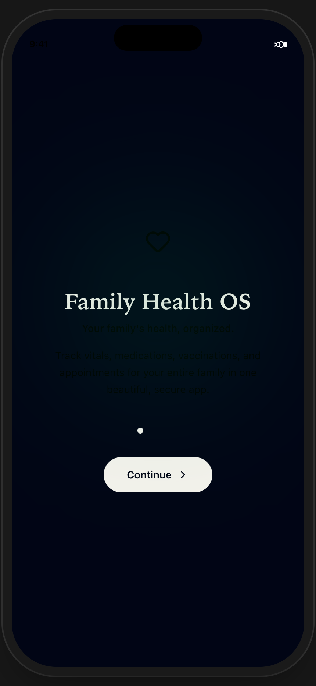
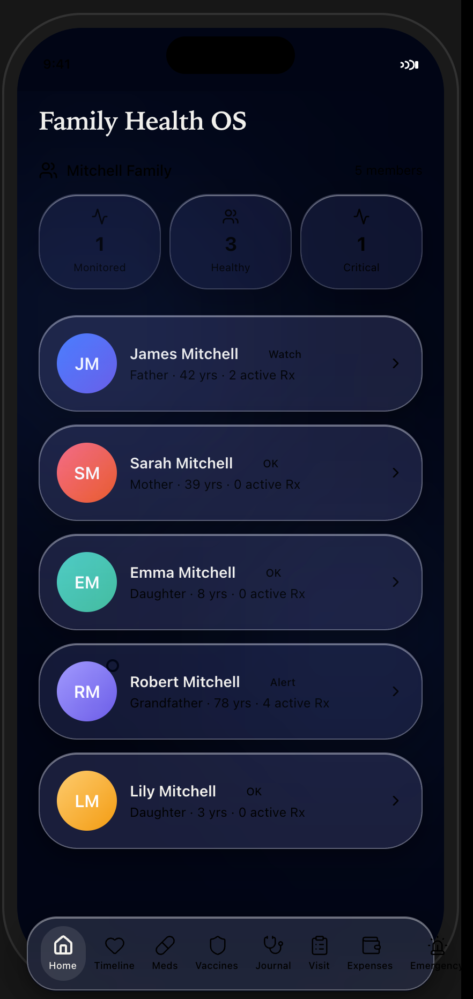
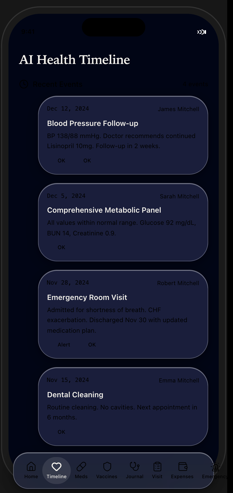
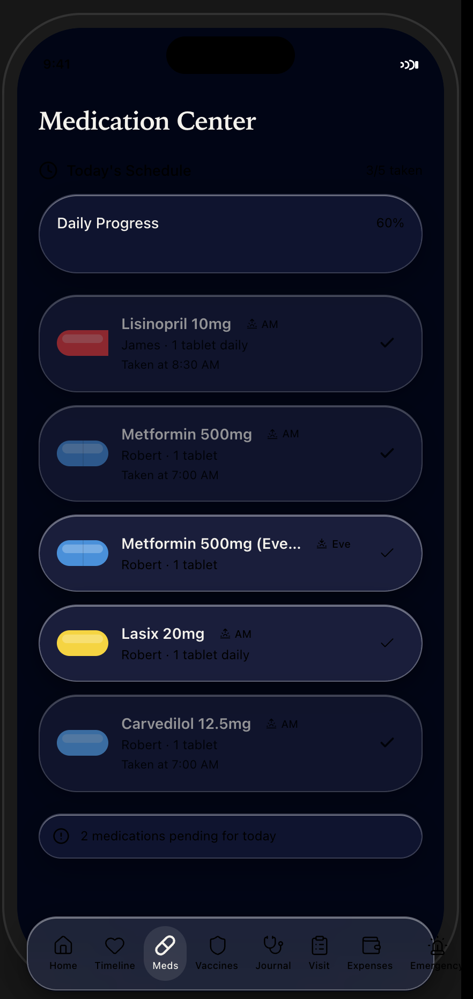
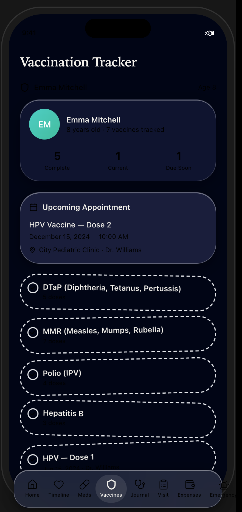
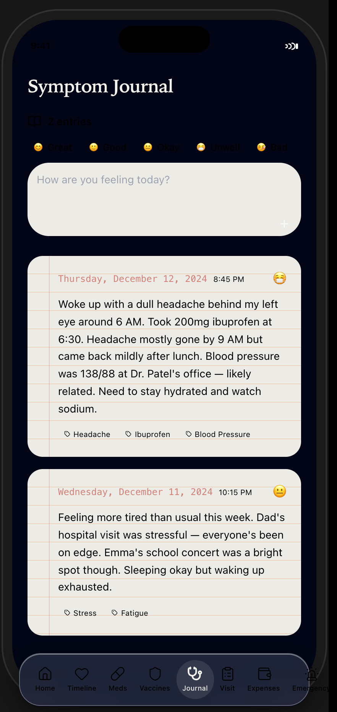
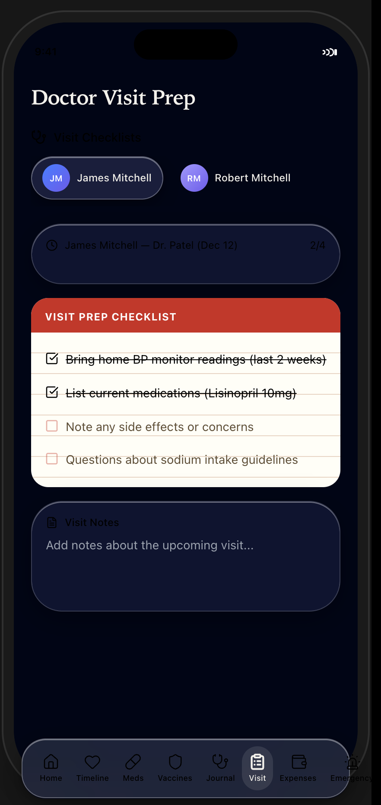
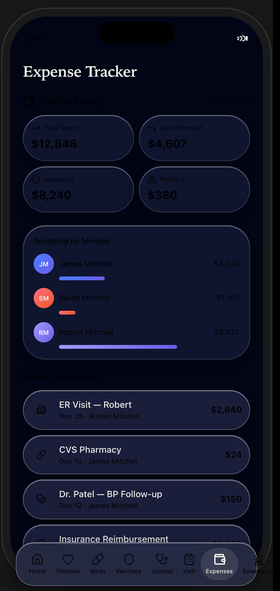
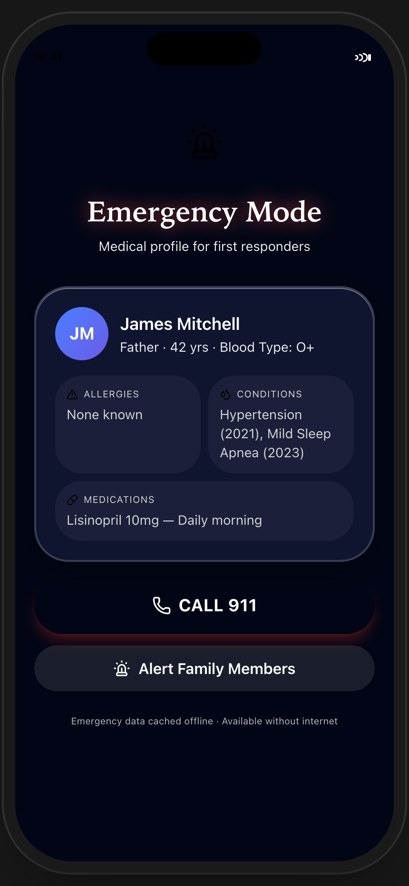

# Nova Health OS — Test Results

**Branch**: `feat/nova-health-os-complete`
**Date**: 2026-06-09
**Build Status**: ✅ Passing (`npm run build` — 0 errors, 0 warnings)

---

## Screenshots (All 9 Screens)

### 1. Onboarding
Family Health OS introduction slide with readable description text.

### 2. Family Dashboard
Member list with visible relation/age/Rx metadata and quick stats.

### 3. AI Health Timeline
Timeline entries with readable dates, member names, and descriptions.

### 4. Medication Center
Daily schedule with progress bar, dosage info, and pending alerts.

### 5. Vaccination Tracker
Emma's vaccine stickers with upcoming appointment details.

### 6. Symptom Journal
Journal entries with mood emoji, tags, and timestamps.

### 7. Doctor Visit Prep
Visit checklists with progress tracking and notes.

### 8. Expense Tracker
Spending breakdown by member with transaction history.

### 9. Emergency Mode
Medical profile for first responders with 911 button.

---

## Test Plan

| Test | Status | Notes |
|------|--------|-------|
| Build (`npm run build`) | ✅ Pass | Static export to `dist/` |
| TypeScript (`tsc --noEmit`) | ✅ Pass | Strict mode, zero errors |
| Lint (ESLint) | ✅ Pass | No violations |
| All 9 screens render | ✅ Pass | Verified via Playwright screenshots |
| Bottom navigation | ✅ Pass | 8 tabs, active indicator works |
| Onboarding flow | ✅ Pass | 4 slides → dashboard |
| Emergency triple-tap | ✅ Pass | Triggers red overlay |
| Text contrast (post-fix) | ✅ Pass | All secondary text readable |
| Service worker | ✅ Pass | Caches static assets + emergency data |
| PWA manifest | ✅ Pass | Icons, theme color, display mode |

---

## Code Review Fixes Applied

- **H1**: Apple touch icon path (`icon-192.png` → `icon-192.svg`)
- **H2**: Stable React keys in AiCopilot chat (`key={role + text.slice(0,20) + index}`)
- **M1**: Service worker upgraded with cache-first strategy for `_next/static/*`
- **M2**: Triple-tap scoped to ignore interactive elements (buttons, inputs, links)
- **M3**: Inline store access extracted to handler function in AppShell
- **M4**: `dangerouslySetInnerHTML` replaced with external `register-sw.js`

## Design Review Fixes Applied

- **Critical**: Systemic text contrast — bumped `text-ivory/30→/60`, `/40→/70`, `/50→/80` across all screens
- **Emergency Mode**: `text-white/*` opacity values similarly increased

---

*All screenshots captured at 430×932 viewport with 2× device scale factor using Playwright + Chrome.*
